# The Branded (Mühürlü)

**2.5D izometrik aksiyon roguelite**: Hades'in döngüsü, Berserk'ün "Tutulma Sonrası" atmosferi.

Tutulma katliamından tek kolu ve tek gözüyle sağ çıkan bir savaşçıyız. Boynundaki **Kurban Mührü** her gece ölüleri ve iblisleri kanının kokusuna çeker. Geceler vahşi yakın dövüşle, sabahlar kamp ateşi başında nefes alarak geçer.

> Unity 6 (URP) ile geliştiriliyor. Şu an **greybox** aşamasında: modeller kapsül ve küp, portreler yer tutucu.

---

## Oyun Döngüsü

Oyun, **Gece Vahşeti** ile **Sabah Huzuru** arasındaki zıtlık üzerine kurulu.

```mermaid
flowchart TD
    subgraph HUB ["🏠 GODO'NUN MAĞARASI (Kalıcı Güvenli Alan / Hub)"]
        WakeUp["✨ Uyanış: Tutulma Sonrası Başlangıç<br/>• Tek Kol & Tek Göz Kayıp<br/>• Boyunda Kanayan Kurban Mührü"]
        Godo["🔨 Godo'nun Demirci Ocağı (Meta-Progression)<br/>• Ejderha Katili (Dragonslayer) Taban Hasar Artışı<br/>• Protez Kol Modifikasyonu: Top Gülesi & Seri Tatar Yayı"]
        Puck["🧚 Puck & Şifalı Elf Tozu<br/>• Kalıcı Can Kapasitesi & Ölümden Dönme (Death Defiance)"]
        Depart["🚪 Mağaradan Çıkış: Seferi Başlat"]
        WakeUp --> Godo
        WakeUp --> Puck
        Godo --> Depart
        Puck --> Depart
    end

    subgraph RUN ["⚔️ SEFER (RUN) DÖNGÜSÜ: BÖLGE 1 - LANETLİ TOPRAKLAR"]
        subgraph NIGHT1 ["🌑 1. GECE: SİS VE HUZURSUZ RUHLAR"]
            N1_Start["🩸 Mühür Kanar & Sis Çöker<br/>(Görüş sadece meşale alanına daralır, nabız sesi yükselir)"]
            N1_Combat["⚔️ Vahşi Yakın Dövüş<br/>• Topraktan Çıkan İskeletler & Gölge Ruhları<br/>• Dragonslayer Ağır Vuruşları, Hitstop & Ekran Titremesi"]
            N1_Survive["☀️ Şafak Söker<br/>(Kalan iblisler çığlık atarak buharlaşır)"]
            N1_Start --> N1_Combat --> N1_Survive
        end

        subgraph DAWN1 ["🌅 1. SABAH: HUZURLU KAMP VE DİNLENME"]
            D1_Camp["🔥 Kamp Ateşi Kurulur<br/>(Kuş sesleri, huzurlu akustik müzik, nefes alma anı)"]
            D1_Dialogue["💬 2D Portre Diyaloğu (Hades Tarzı UI)<br/>(Rickert / Gezgin Paralı Asker ile Sohbet)"]
            D1_Boon["🎁 Geçici Sefer Güçlenmesi Seçimi<br/>• Kılıca Alev Yağı (Yanma Hasarı)<br/>• Hızlı Atılma Tılsımı<br/>• Şifalı Bandaj (+Can)"]
            D1_Camp --> D1_Dialogue --> D1_Boon
        end

        subgraph NIGHT2 ["🌑 2. GECE: İBLİS TAZILARI VE ZIRHLI SÜRÜLER"]
            N2_Start["🩸 Mühür Şiddetle Zonklamaya Başlar<br/>(Ekran kenarları kızarır, kırmızı sis)"]
            N2_Combat["⚔️ Yüksek Tansiyonlu Çarpışma<br/>• Hızlı İblis Tazıları & Zırhlı Ölü Şövalyeler<br/>• Sol Kol Mekaniği: Seri Tatar Yayı & Yakın Mesafe Top Atışı"]
            N2_Survive["☀️ Şafak Söker"]
            N2_Start --> N2_Combat --> N2_Survive
        end

        subgraph DAWN2 ["🌅 2. SABAH: YIKIK MABET & KAFATASI ŞÖVALYESİ"]
            D2_Shrine["🗿 Antik Mabet Harabeleri"]
            D2_Skull["💬 Kafatası Şövalyesi (Skull Knight) Belirir<br/>(2D Portre, Felsefi Kehanet Diyaloğu)"]
            D2_Relic["⚡ Antik Kalıntı Lütfu Seçimi<br/>(Havari Savaşı Öncesi Büyük Geçici Güçlendirme)"]
            D2_Shrine --> D2_Skull --> D2_Relic
        end

        subgraph BOSS_NIGHT ["🔥 3. GECE: BÖLGE PATRONU - BÜYÜK HAVARİ (APOSTLE)"]
            Boss_Spawn["👁️ Gökyüzü Kan Rengine Döner<br/>(Devasa İblis Havari Sahneye İner)"]
            Boss_Fight["⚔️ Çok Aşamalı Vahşi Patron Savaşı<br/>• Alan Etkili Darbelerden Dash ile Kaçış<br/>• Öfke Modu (Berserk Rage): Yüksek Hasar & Can Eksilmesi"]
            Boss_Victory["🏆 Havari Katledildi!<br/>(Büyük İblis Kalbi & Nadir Kara Maden Kazanılır)"]
            Boss_Spawn --> Boss_Fight --> Boss_Victory
        end

        Depart --> N1_Start
        N1_Survive --> D1_Camp
        D1_Boon --> N2_Start
        N2_Survive --> D2_Shrine
        D2_Relic --> Boss_Spawn
    end

    subgraph DEATH_SYSTEM ["💀 ÖLÜM VE GERİ DÖNÜŞ SİSTEMİ"]
        DeathEvent["⚰️ Karakter Yenildi (Can Sıfırlandı)"]
        DragBack["Karanlık Ruhlar Seni Çeker...<br/>Fakat Kurban Mührünün İntikam Ateşi Ölümüne İzin Vermez!"]
        Respawn["🩸 Kan Revan İçinde Godo'nun Ocağında Uyanış<br/>(Geçici yağlar sıfırlanır, İblis Külleri korunur)"]
        DeathEvent --> DragBack --> Respawn
        Respawn --> Godo
    end

    N1_Combat -.->|Ölüm| DeathEvent
    N2_Combat -.->|Ölüm| DeathEvent
    Boss_Fight -.->|Ölüm| DeathEvent

    Boss_Victory --> NextBiome["🌟 BÜYÜK ŞAFAK: 2. BÖLGEYE GEÇİŞ<br/>(Veya Mağaraya Ganimetle Muzaffer Dönüş)"]
    NextBiome -.-> Godo
```



Tüm tasarım, harita, dövüş ve mimari detayları için: **[Tasarım Dokümanı (GDD)](docs/GDD.md)**

---

## Yol Haritası

| Aşama | İçerik | Durum |
|---|---|---|
| 1. Greybox Temelleri | WASD hareket, fareye dönme, dash, input buffer ile kılıç savurma | ✅ |
| 2. Hasar ve İlk Düşman | `IDamageable`, NavMesh düşman, hitstop ve vuruş hissi | ✅ |
| 3. Gece/Sabah Döngüsü | Düşman dalgaları, şafak söküşü, kamp ateşi | ✅ |
| 4. Diyalog ve UI | 2D portreli diyalog, can barı, geçici kılıç yağı seçimi | ✅ |
| 5. Godo'nun Atölyesi | Mağara sahnesi, kalıcı yükseltmeler, ölüm döngüsü | ✅ |

## Şu An Oyunda Neler Var

- **Dövüş:** Input buffer'lı kılıç savurma (OverlapSphere taraması), i-frame'li dash, hitstop ve kamera sarsıntısı.
- **Düşmanlar:** Oyuncunun etrafını saran NavMesh sürüsü; tank, koşucu, uzaktan ateş eden ve yer altından çıkan tipler; yapışıp yavaşlatan gölge ruhları, açık kollayan tazılar, önden kalkanlı şövalyeler, geniş sopalı troll, eskortlarını dirilten tarikatçı ve ölünce hasar alanı bırakan et yığını. Can barları ilk vuruşa kadar gizli.
- **Gece/Sabah:** Dalga dalga gelen düşmanlar, şafakta buharlaşan iblisler, sabah ışığına geçiş ve kamp ateşi.
- **Kamp:** Hades tarzı portreli diyalog, ardından 3 kartlık güçlenme seçimi (Alev Yağı, Hızlı Atılma Tılsımı, Şifalı Bandaj).
- **HUD:** Hasarı soluk bir izle gösteren can barı ve İblis Külü sayacı.
- **Godo'nun Mağarası:** Oyun burada başlar. Godo'nun ocağında *Ejderha Katili* (taban hasar), Puck'ta *Kalıcı Can Kapasitesi* ve *Ölümden Dönme* İblis Külleriyle alınır; mağara ağzından sefere çıkılır.
- **Ölüm döngüsü:** Ölünce karanlık ruhlar yazısı, ardından Godo'nun ocağında uyanış. Geçici yağlar sıfırlanır, küller ve yükseltmeler kalır (`save.json`).

## Kontroller

| Tuş | Eylem |
|---|---|
| `W A S D` / Ok tuşları | Hareket |
| Fare | Nişan / bakış yönü |
| Sol tık | Kılıç saldırısı |
| Sağ tık (basılı) | Sol koldan seri tatar yayı (şarjör + reload) |
| Orta tuş | Kol topu: kamp başına bir atış, yayı kırar, geri savurur |
| `Space` | Atılma (dash) |
| `E` | Etkileşim (kamp ateşi, Godo, Puck, mağara çıkışı) |
| `Esc` / `E` | Yükseltme panelini kapat |
| `E` / `Space` / Sol tık | Diyaloğu ilerlet |

## Teknik Altyapı

- **Motor:** Unity `6000.6.0f1`, Universal Render Pipeline
- **Girdi:** Input System
- **Kamera:** Cinemachine (sabit izometrik açı)
- **Yapay zekâ:** NavMesh
- **Arayüz:** uGUI + TextMeshPro
- **Veri:** Geceler, güçlenmeler, yükseltmeler ve diyaloglar `ScriptableObject` olarak tutulur; kalıcı ilerleme JSON kaydında

## Proje Yapısı

```
Assets/_Project/
├── Art/           Portreler ve görseller
├── Data/          ScriptableObject verileri (Boons, Dialogue, Nights, Upgrades)
├── Materials/
├── Prefabs/       Oyuncu, düşmanlar, dünya objeleri, UI
├── Scenes/        Hub_GodoCave.unity, Greybox_Asama1.unity
└── Scripts/
    ├── Core/      GameEvents (sistemler arası olay kanalı)
    ├── Player/    Hareket, dash, girdi, kılıç, ölüm
    ├── Combat/    IDamageable, HealthComponent, hitbox, Projectile
    ├── Enemies/   Düşman yapay zekâsı ve tipleri
    ├── Loop/      Gece/sabah döngüsü, dalgalar, kamp ateşi
    ├── Dialogue/  Diyalog verisi ve yöneticisi
    ├── Boons/     Güçlenme verisi ve etkileri
    ├── Meta/      Kalıcı ilerleme, kayıt, yükseltmeler, sahne geçişi
    ├── Interaction/ Etkileşilebilir objeler ve oyuncu tarafı
    ├── Hub/       Yükseltme istasyonları, mağara çıkışı
    ├── UI/        Can barı, güçlenme kartları, yükseltme paneli, ekran geçişleri
    └── DevTools/  Test amaçlı yardımcılar
```

Kod kuralları: **[docs/CodeStyles.md](docs/CodeStyles.md)**

## Çalıştırma

1. Repoyu klonla ve Unity Hub'dan **Unity 6000.6.0f1** ile aç.
2. `Assets/_Project/Scenes/Hub_GodoCave.unity` sahnesini aç (sefer sahnesi `Greybox_Asama1.unity` doğrudan da açılabilir).
3. Play'e bas.
