# The Branded

[English](README.md) · **Türkçe**

**Üçüncü şahıs hack & slash roguelite**: Hades'in run döngüsü, Berserk'ün Tutulma sonrası atmosferinde.

Tutulma katliamından tek kolu ve tek gözüyle çıkmış bir savaşçıyı oynuyorsun. Boynundaki **Kurban Damgası** her gece kanıyor ve ölülerle iblisleri kanının kokusuna çekiyor. Geceler vahşi yakın dövüşle, sabahlar kamp ateşinin yanında nefeslenerek geçiyor.

> [!IMPORTANT]
> **Durum: geliştirme durduruldu.** Oyun bitmeden geliştirme durdu; bu depo aktif bir proje olarak değil, bir kayıt olarak tutuluyor.
>
> Buna iki şey yol açtı. Birincisi, tasarım dokümanının istedikleriyle onu yazarken inşa etmeyi bildiklerim arasındaki mesafeydi. İkincisi assetlerdi: kullanılabilir, iskeleti kurulmuş (rigged) bir karakter bulamadığım için oyun **greybox** kapsüllerinin ötesine hiç geçemedi. Karar kıldığım model, yaklaşık 480 kopuk mesh parçasından oluşan bir rip çıktı; her parmak, avuca bağlı olmayan serbest bir ada halindeydi. Otomatik rigleme araçları parmak zincirlerini bulmak için bağlı yüzey üzerinde yürüdüğünden, sessizce parmak kemiği olmayan bir ele geri düşüyorlar. Bir şey tutabilen eller ve saldırı animasyonları olmadan karakter tarafı tıkandı, projenin kendisi de onunla birlikte.
>
> Burada olan şey çalışıyor. Gece/sabah döngüsü, dövüş, düşman çeşitliliği, hub ve meta-ilerleme hepsi çalışıyor ve oynanabilir. Gördüğün her şey bir kapsül, bir küp ya da bir yer tutucu portre.

---

## Oyun Döngüsü

Oyun, **Gece Vahşeti** ile **Sabah Sükûneti** arasındaki karşıtlık üzerine kurulu.

```mermaid
flowchart TD
    subgraph HUB ["🏠 GODOT'UN MADENİ (Kalıcı Güvenli Bölge / Hub)"]
        WakeUp["✨ Uyanış: Tutulma'dan Sonra<br/>• Bir Kol ve Bir Göz Kayıp<br/>• Kurban Damgası Kanıyor"]
        Godot["🔨 Godot'un Ocağı (Meta-İlerleme)<br/>• Dragonslayer Temel Hasarı<br/>• Protez Kol Modülleri: Top & Seri Atışlı Arbalet"]
        Puck["🧚 Puck & İyileştirici Elf Tozu<br/>• Kalıcı Can Kapasitesi & Ölüme Meydan Okuma"]
        Depart["🚪 Dağ Yolundan Aşağı: Run'ı Başlat"]
        WakeUp --> Godot
        WakeUp --> Puck
        Godot --> Depart
        Puck --> Depart
    end

    subgraph RUN ["⚔️ RUN DÖNGÜSÜ: BİYOM 1 - LANETLİ TOPRAKLAR"]
        subgraph NIGHT1 ["🌑 GECE 1: SİS VE HUZURSUZ RUHLAR"]
            N1_Start["🩸 Damga Kanıyor & Sis Çöküyor<br/>(Görüş meşaleye daralır, bir kalp atışı yükselir)"]
            N1_Combat["⚔️ Vahşi Yakın Dövüş<br/>• Topraktan Çıkan İskeletler & Gölge Ruhları<br/>• Ağır Dragonslayer Savuruşları, Hitstop & Ekran Sarsıntısı"]
            N1_Survive["☀️ Şafak Söküyor<br/>(Kalan iblisler çığlıklarla buharlaşır)"]
            N1_Start --> N1_Combat --> N1_Survive
        end

        subgraph DAWN1 ["🌅 SABAH 1: SESSİZ BİR KAMP"]
            D1_Camp["🔥 Kamp Ateşi Yakılır<br/>(Kuş sesleri, sakin akustik müzik, nefeslenmek için bir an)"]
            D1_Dialogue["💬 2D Portre Diyaloğu (Hades tarzı arayüz)<br/>(Rickert / gezgin bir paralı askerle konuşma)"]
            D1_Boon["🎁 Geçici Bir Run Lütfu Seç<br/>• Kılıca Alev Yağı (Yanma Hasarı)<br/>• Hızlı Atılım Tılsımı<br/>• İyileştirici Sargı (+Can)"]
            D1_Camp --> D1_Dialogue --> D1_Boon
        end

        subgraph NIGHT2 ["🌑 GECE 2: İBLİS TAZILARI VE ZIRHLI SÜRÜLER"]
            N2_Start["🩸 Damga Şiddetle Zonkluyor<br/>(Ekran kenarları kızarır, kırmızı sis)"]
            N2_Combat["⚔️ Yüksek Gerilimli Dövüş<br/>• Hızlı İblis Tazıları & Zırhlı Ölü Şövalyeler<br/>• Sol Kol: Seri Atışlı Arbalet & Bitişik Mesafe Topu"]
            N2_Survive["☀️ Şafak Söküyor"]
            N2_Start --> N2_Combat --> N2_Survive
        end

        subgraph DAWN2 ["🌅 SABAH 2: YIKIK TAPINAK & SKULL KNIGHT"]
            D2_Shrine["🗿 Kadim Bir Tapınağın Kalıntıları"]
            D2_Skull["💬 Skull Knight Belirir<br/>(2D Portre, Kehanet Dolu Bir Diyalog)"]
            D2_Relic["⚡ Kadim Bir Emanet Lütfu Seç<br/>(Havari Öncesi Büyük Geçici Güçlenme)"]
            D2_Shrine --> D2_Skull --> D2_Relic
        end

        subgraph BOSS_NIGHT ["🔥 GECE 3: BİYOM BOSS'U - BÜYÜK HAVARİ"]
            Boss_Spawn["👁️ Gökyüzü Kan Kırmızısına Döner<br/>(Devasa Bir İblis Havari İner)"]
            Boss_Fight["⚔️ Çok Fazlı Bir Boss Dövüşü<br/>• Alan Saldırılarından Atılımla Kaçış<br/>• Berserk Öfkesi: Yüksek Hasar & Eriyen Can"]
            Boss_Victory["🏆 Havari Öldürüldü!<br/>(Büyük Bir İblis Kalbi & Nadir Kara Cevher)"]
            Boss_Spawn --> Boss_Fight --> Boss_Victory
        end

        Depart --> N1_Start
        N1_Survive --> D1_Camp
        D1_Boon --> N2_Start
        N2_Survive --> D2_Shrine
        D2_Relic --> Boss_Spawn
    end

    subgraph DEATH_SYSTEM ["💀 ÖLÜM VE DÖNÜŞ"]
        DeathEvent["⚰️ Yenildin (Can Sıfırlandı)"]
        DragBack["Karanlık ruhlar seni aşağı çeker...<br/>Ama Damga'nın intikam açlığı ölmene izin vermez!"]
        Respawn["🩸 Godot'un Ocağında Kan İçinde Uyanış<br/>(Geçici yağlar sıfırlanır, İblis Külü kalır)"]
        DeathEvent --> DragBack --> Respawn
        Respawn --> Godot
    end

    N1_Combat -.->|Ölüm| DeathEvent
    N2_Combat -.->|Ölüm| DeathEvent
    Boss_Fight -.->|Ölüm| DeathEvent

    Boss_Victory --> NextBiome["🌟 BÜYÜK ŞAFAK: BİYOM 2'YE<br/>(Ya da Ganimetle Madene Dönüş)"]
    NextBiome -.-> Godot
```



Tasarımın, haritanın, dövüşün ve mimarinin tamamı için: **[Tasarım Dokümanı (GDD)](docs/GDD.md)** (İngilizce)

---

## Yol Haritası

| Aşama | İçerik | Durum |
|---|---|---|
| 1. Greybox Temelleri | WASD hareketi, dönüş, atılım, girdi tamponlamalı kılıç savuruşu | ✅ |
| 2. Hasar ve İlk Düşman | `IDamageable`, NavMesh düşmanı, hitstop ve vuruş hissi | ✅ |
| 3. Gece/Sabah Döngüsü | Düşman dalgaları, şafak, kamp ateşi | ✅ |
| 4. Diyalog ve Arayüz | 2D portre diyaloğu, can barı, geçici kılıç yağı seçimi | ✅ |
| 5. Godot'un Atölyesi | Hub sahnesi (maden + kulübe + koru), kalıcı yükseltmeler, ölüm döngüsü | ✅ |
| 6. Dövüş Derinliği | İptal pencereli kombo zinciri, yüklemeli vuruş, dönüş saldırısı, atılım vuruşu | ✅ |
| 7. Kamera Değişimi | Sabit izometrik açıdan Witcher 3 tarzı yörüngeli üçüncü şahıs kameraya | ✅ |
| 8. Karakter Modeli | Greybox kapsüllerinin yerini alacak riglenmiş, animasyonlu bir karakter | ❌ Yapılmadı — proje burada durdu |

## Şu An Oyunda Ne Var

- **Dövüş:** Girdi tamponlamalı bir kılıç kombosu (`Physics.OverlapSphere` ile taranıyor). Her savuruşun toparlanması bir iptal penceresiyle bitiyor, böylece zincir takılmadan akıyor. Saldırı tuşunu basılı tutmak ağır bir vuruş yüklüyor, `Q` bir dönüş saldırısı savuruyor (komboyu bağlayarak çıkınca 1.5× hasar) ve atılımın hemen ardından saldırmak özel bir atılım vuruşu veriyor. Atılımın dokunulmazlık kareleri (i-frame) var; isabetler hitstop ve kamera sarsıntısı üretiyor.
- **Düşmanlar:** Oyuncuyu çevreleyen bir NavMesh sürüsü — tank, hücumcu, menzilli ve yeraltından çıkan tipler; sana yapışıp yavaşlatan gölge ruhları, açık bekleyen tazılar, önden bloklayan şövalyeler, geniş sopalı bir trol, maiyetini dirilten bir tarikatçı ve öldüğünde hasar veren bir birikinti bırakan et yığını. Can barları ilk isabete kadar gizli kalıyor.
- **Gece/Sabah:** Düşman dalgaları, şafakta buharlaşan iblisler, sabah ışığına ve kamp ateşine geçiş.
- **Kamp:** Hades tarzı portre diyaloğu, ardından üç lütuf kartından biri (Alev Yağı, Hızlı Atılım Tılsımı, İyileştirici Sargı).
- **HUD:** Hasarı sönümlenen bir iz olarak gösteren can barı ve bir İblis Külü sayacı.
- **Godot'un Madeni:** Oyun, eski madenin içindeki ocakta, Godot'un su değirmenli kulübesinin yanında açılıyor; etrafında bir koru, bir cephanelik, bir şelale ve Kılıçlar Tepesi var. *Dragonslayer* (temel hasar) Godot'un ocağından, *Kalıcı Can Kapasitesi* ve *Ölüme Meydan Okuma* Puck'tan İblis Külü ile satın alınıyor; run güneydeki dağ yolundan aşağı başlıyor.
- **Ölüm döngüsü:** Ölümde önce karanlık ruhlar metni, sonra Godot'un ocağında uyanış. Geçici yağlar sıfırlanıyor; kül ve yükseltmeler kalıcı (`save.json`).

## Kontroller

| Tuş | Eylem |
|---|---|
| `W A S D` / Yön tuşları | Hareket |
| Fare | Kamerayı karakterin etrafında döndürür; imleç kilitli ve kameranın baktığı yere nişan alırsın |
| Sol tık | Kılıç saldırısı (kombo) |
| Sol tık (basılı) | Yüklemeli ağır vuruş |
| `Q` | Dönüş saldırısı; komboyu bağlayarak çıkınca ek hasar |
| Sağ tık (basılı) | Sol koldaki seri atışlı arbalet (şarjör + yeniden doldurma) |
| Orta tık | Kol topu: kamp başına tek atış, arbaleti bozar, seni geri savurur |
| `Space` | Atılım; hemen ardından gelen sol tık atılım vuruşuna dönüşür |
| `E` | Etkileşim (kamp ateşi, Godot, Puck, dağ yolu) |
| `Esc` / `E` | Yükseltme panelini kapat |
| `E` / `Space` / Sol tık | Diyaloğu ilerlet |

## Teknik Yığın

- **Motor:** Unity `6000.6.0f1`, Universal Render Pipeline `17.6.0`
- **Girdi:** Input System `1.20.0` (eylemler kod içinde kuruluyor; `.inputactions` asseti yok)
- **Kamera:** Cinemachine `6.6.0` — Witcher 3 tarzı yörüngeli üçüncü şahıs kamera; yörünge karakterin başının üzerinde merkezleniyor ve karakter karenin alt yarısında kalıyor
- **Karakter:** `CharacterController` (Rigidbody yok)
- **Yapay zekâ:** NavMesh
- **Arayüz:** uGUI + TextMeshPro
- **Veri:** Geceler, lütuflar, yükseltmeler ve diyaloglar `ScriptableObject` assetleri; kalıcı ilerleme JSON olarak kaydediliyor

> Oyun içi metinler (diyaloglar, HUD etiketleri) Türkçe. Kod, yorumlar ve dokümantasyon İngilizce.

## Proje Yapısı

```
Assets/_Project/
├── Art/           Portraits/ (diyalog portreleri), UI/ (arayüz görselleri)
├── Data/          ScriptableObject verileri (Boons, Dialogue, Nights, Upgrades)
├── Materials/
├── Prefabs/       Oyuncu, düşmanlar, dünya nesneleri, arayüz
├── Scenes/        Hub_GodotForge.unity, Greybox_Asama1.unity
└── Scripts/
    ├── Core/      GameEvents (sistemler arası olay kanalı), FlatMath, Easing
    ├── Player/    Hareket, atılım, girdi, kamera, nişan, kılıç, arbalet, ölüm
    ├── Combat/    IDamageable, HealthComponent, vuruş alanları, Projectile
    ├── Enemies/   Düşman yapay zekâsı ve tipleri
    ├── Loop/      Gece/sabah döngüsü, dalgalar, kamp ateşi
    ├── Dialogue/  Diyalog verisi ve yöneticisi
    ├── Boons/     Lütuf verisi ve etkileri
    ├── Meta/      Kalıcı ilerleme, kayıt, yükseltmeler, sahne geçişleri
    ├── Interaction/ Etkileşilebilir nesneler ve oyuncu tarafı
    ├── Hub/       Yükseltme istasyonları, hub çıkışı
    ├── UI/        Can barı, lütuf kartları, yükseltme paneli, ekran kararmaları
    └── DevTools/  Test yardımcıları
```

Kod kuralları: **[docs/CodeStyles.md](docs/CodeStyles.md)** (İngilizce)

## Nasıl Çalıştırılır

1. Depoyu klonla ve Unity Hub'dan **Unity 6000.6.0f1** ile aç.
2. `Assets/_Project/Scenes/Hub_GodotForge.unity` sahnesini aç (run sahnesi `Greybox_Asama1.unity` da doğrudan açılabilir).
3. Play'e bas.

Depo, ikili assetler (`.png`, `.ttf`, `.fbx` ve benzeri) için **Git LFS** kullanıyor. Klonlamadan önce `git lfs install` çalıştır, yoksa bu dosyalar metin işaretçisi olarak iner.

## Lisans

MIT — bkz. [LICENSE](LICENSE). Berserk, Kentaro Miura'nın eseridir; bu, öğrenme amaçlı, ticari olmayan bir hayran projesidir ve hak sahipleriyle bir bağlantısı yoktur.
