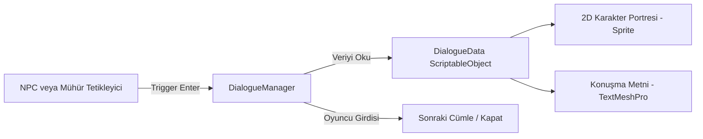

# PROJECT: THE BRANDED (MÜHÜRLÜ)
## 2.5D İzometrik Aksiyon Roguelite — Master Teknik & Tasarım Dokümanı (GDD)
*Berserk "Tutulma Sonrası" Esinlenmesi & Unity URP Üretim Kılavuzu*

---

## 1. Proje Özeti ve Hikaye Temeli

* **Oyun Türü:** 2.5D İzometrik Hack & Slash Roguelite (Hades döngüsü + Berserk atmosferi).
* **Kamera Açısı:** Sabit 50° eğimli, 45° döndürülmüş izometrik perspektif.
* **Hikaye Başlangıcı (Lore):** 
  * Karakter, "Tutulma" (The Eclipse) katliamından sağ kurtulmuş; tek kolunu ve tek gözünü kaybetmiştir.
  * Boynundaki **Kurban Mührü (Brand of Sacrifice)** laneti nedeniyle ölüler ve iblisler sürekli kanının kokusuna çekilmektedir.
* **Ana Merkez (Hub):** Dağlardaki **Godot'nun Madeni**: eski bir madenin içindeki demirci ocağı. Maden ağzının yanında su çarklı küçük bir kulübe (dekoratif, içine girilmez), önünde ağaçlık, cephanelik, şelale ve Şahinler için dikilmiş Kılıçlar Tepesi bulunur.
  * Perilerin (Puck) şifalı tozu ve antik mabet koruması sayesinde iblislerin giremediği yegane güvenli sığınaktır.
  * Karakter seferlerde yenildiğinde kan revan içinde madendeki ocağın başında uyanır.

---

## 2. Oyun ve Ritim Döngüsü (Master Game Loop)

Oyun, sürekli savaşmak yerine **"Gece Vahşeti"** ile **"Sabah Huzuru"** arasındaki derin zıtlık (kontrast) üzerine kuruludur.

```mermaid
flowchart TD
    %% HUB ALANI
    subgraph HUB ["🏠 GODOT'NUN MADENİ (Kalıcı Güvenli Alan / Hub)"]
        WakeUp["✨ Uyanış: Tutulma Sonrası Başlangıç<br/>• Tek Kol & Tek Göz Kayıp<br/>• Boyunda Kanayan Kurban Mührü"]
        Godot["🔨 Godot'nun Demirci Ocağı (Meta-Progression)<br/>• Ejderha Katili (Dragonslayer) Taban Hasar Artışı<br/>• Protez Kol Modifikasyonu: Top Gülesi & Seri Tatar Yayı"]
        Puck["🧚 Puck & Şifalı Elf Tozu<br/>• Kalıcı Can Kapasitesi & Ölümden Dönme (Death Defiance)"]
        Depart["🚪 Dağ Patikasından İniş: Seferi Başlat"]
        
        WakeUp --> Godot
        WakeUp --> Puck
        Godot --> Depart
        Puck --> Depart
    end

    %% BÖLGE 1 SEFER DÖNGÜSÜ
    subgraph RUN ["⚔️ SEFER (RUN) DÖNGÜSÜ: BÖLGE 1 - LANETLİ TOPRAKLAR"]
        
        %% 1. GECE
        subgraph NIGHT1 ["🌑 1. GECE: SİS VE HUZURSUZ RUHLAR"]
            N1_Start["🩸 Mühür Kanar & Sis Çöker<br/>(Görüş sadece meşale alanına daralır, nabız sesi yükselir)"]
            N1_Combat["⚔️ Vahşi Yakın Dövüş<br/>• Topraktan Çıkan İskeletler & Gölge Ruhları<br/>• Dragonslayer Ağır Vuruşları, Hitstop & Ekran Titremesi"]
            N1_Survive["☀️ Şafak Söker<br/>(Kalan iblisler çığlık atarak buharlaşır)"]
            N1_Start --> N1_Combat --> N1_Survive
        end

        %% 1. SABAH
        subgraph DAWN1 ["🌅 1. SABAH: HUZURLU KAMP VE DİNLENME"]
            D1_Camp["🔥 Kamp Ateşi Kurulur<br/>(Kuş sesleri, huzurlu akustik müzik, nefes alma anı)"]
            D1_Dialogue["💬 2D Portre Diyaloğu (Hades Tarzı UI)<br/>(Rickert / Gezgin Paralı Asker ile Sohbet)"]
            D1_Boon["🎁 Geçici Sefer Güçlenmesi Seçimi<br/>• Kılıca Alev Yağı (Yanma Hasarı)<br/>• Hızlı Atılma Tılsımı<br/>• Şifalı Bandaj (+Can)"]
            D1_Camp --> D1_Dialogue --> D1_Boon
        end

        %% 2. GECE
        subgraph NIGHT2 ["🌑 2. GECE: İBLİS TAZILARI VE ZIRHLI SÜRÜLER"]
            N2_Start["🩸 Mühür Şiddetle Zonklamaya Başlar<br/>(Ekran kenarları kızarır, kırmızı sis)"]
            N2_Combat["⚔️ Yüksek Tansiyonlu Çarpışma<br/>• Hızlı İblis Tazıları & Zırhlı Ölü Şövalyeler<br/>• Sol Kol Mekaniği: Seri Tatar Yayı & Yakın Mesafe Top Atışı"]
            N2_Survive["☀️ Şafak Söker"]
            N2_Start --> N2_Combat --> N2_Survive
        end

        %% 2. SABAH
        subgraph DAWN2 ["🌅 2. SABAH: YIKIK MABET & KAFATASI ŞÖVALYESİ"]
            D2_Shrine["🗿 Antik Mabet Harabeleri"]
            D2_Skull["💬 Kafatası Şövalyesi (Skull Knight) Belirir<br/>(2D Portre, Felsefi Kehanet Diyaloğu)"]
            D2_Relic["⚡ Antik Kalıntı Lütfu Seçimi<br/>(Havari Savaşı Öncesi Büyük Geçici Güçlendirme)"]
            D2_Shrine --> D2_Skull --> D2_Relic
        end

        %% 3. GECE - BOSS
        subgraph BOSS_NIGHT ["🔥 3. GECE: BÖLGE PATRONU - BÜYÜK HAVARİ (APOSTLE)"]
            Boss_Spawn["👁️ Gökyüzü Kan Rengine Döner<br/>(Devasa İblis Havari Sahneye İner)"]
            Boss_Fight["⚔️ Çok Aşamalı Vahşi Patron Savaşı<br/>• Alan Etkili Darbelerden Dash ile Kaçış<br/>• Öfke Modu (Berserk Rage): Yüksek Hasar & Can Eksilmesi"]
            Boss_Victory["🏆 Havari Katledildi!<br/>(Büyük İblis Kalbi & Nadir Kara Maden Kazanılır)"]
            Boss_Spawn --> Boss_Fight --> Boss_Victory
        end

        Depart --> N1_Start
        N1_Survive --> D1_Camp
        D1_Boon --> N2_Start
        N2_Survive --> D2_Shrine
        D2_Relic --> Boss_Spawn
    end

    %% ÖLÜM VE GERİ DÖNÜŞ (METAPROGRESSION)
    subgraph DEATH_SYSTEM ["💀 ÖLÜM VE GERİ DÖNÜŞ SİSTEMİ"]
        DeathEvent["⚰️ Karakter Yenildi (Can Sıfırlandı)"]
        DragBack["Karanlık Ruhlar Seni Çeker...<br/>Fakat Kurban Mührünün İntikam Ateşi Ölümüne İzin Vermez!"]
        Respawn["🩸 Kan Revan İçinde Godot'nun Ocağında Uyanış<br/>(Geçici yağlar sıfırlanır, İblis Külleri korunur)"]
        
        DeathEvent --> DragBack --> Respawn
        Respawn --> Godot
    end

    %% BAĞLANTILAR
    N1_Combat -.->|Ölüm| DeathEvent
    N2_Combat -.->|Ölüm| DeathEvent
    Boss_Fight -.->|Ölüm| DeathEvent

    Boss_Victory --> NextBiome["🌟 BÜYÜK ŞAFAK: 2. BÖLGEYE GEÇİŞ<br/>(Veya Madene Ganimetle Muzaffer Dönüş)"]
    NextBiome -.-> Godot
```



---

## 3. Harita ve Seviye Tasarımı (Modüler Kitbash Pipeline)

> [!IMPORTANT]
> **Altın Kural:** Kesinlikle Unity Terrain veya Blender'da tek parça devasa zemin kullanılmaz. Tüm zindanlar `4m x 4m` grid karoları ile inşa edilir.

### A. Modüler Zemin Parça Standartları:
1. `Floor_Cobblestone_4x4`: Standart 4x4 metre zemin karosu.
2. `Wall_Stone_4m`: 3.5 metre yüksekliğinde düz duvar bloğu.
3. `Wall_Corner_Inner / Outer`: Köşe duvar parçaları.
4. `Archway_Gate`: Kapanıp açılabilen geçiş kapısı.
5. `Pillar_Obstacle`: Siper ve çarpışma engeli.

### B. Görsel ve Işıklandırma Optimizasyonu:
* **Görsel Tasarruf:** Geceleri zifiri karanlık hakimdir. Görüş alanı meşaleyle sınırlı olduğu için arka plandaki uzak dağları veya binaları modellemek gerekmez; sis ve karanlık görsel yükü çözer.
* **Işık Kuralı (Performans):** Sadece ana karakterin meşalesine gerçek zamanlı `Soft Shadows` verilir. Duvardaki veya yerdeki diğer tüm meşalelerin gölgeleri kapalıdır (`No Shadows`).

### C. Harita Çeşitliliği Mimarisi: "Hades Yöntemi" (3 Katmanlı Sistem)
Oyuncunun her seferde farklı hissetmesi için tamamen rastgele matematiksel zindan (Minecraft/Noita gibi) yazılmaz; çünkü bu kamera açısını bozar ve ruhsuz hissettirir. Bunun yerine **Hades ve Dead Cells'in kullandığı modüler oda havuzu** kullanılır:

1. **Katman 1 (Oda Havuzu - Handcrafted Room Prefabs):**
   * Her bölge için (Örn: Lanetli Orman) 10-15 adet el yapımı, dengeli oda prefab'ı tasarlanır.
   * Oyun bu odaların sırasını her seferde tamamen rastgele seçer (`RoomPool.GetRandom()`).
2. **Katman 2 (Dinamik Siper ve Tuzak Dağılımı):**
   * Aynı odaya tekrar girsen bile odadaki siper sütunları, kırılabilir çömlekler veya tuzaklar her seferinde rastgele farklı noktalarda doğar (Prop Randomization).
3. **Katman 3 (Düşman Kombinasyonları ve Kapı Seçimi):**
   * Aynı odada bazen 20 tane zayıf hayalet sürüsü basarken, bir sonraki seferde 2 zırhlı elit şövalye ve zehirli tazılar doğar.
   * Oda bittiğinde 2 farklı kapı açılır ve oyuncu kapının üzerindeki ödüle göre rotasını kendi seçer (Örn: Sol kapı = Kılıç Yağı, Sağ kapı = İblis Külü).

---

## 4. Karakter, Dövüş ve Prefab Mimarisi

Karakterin modelleri değiştiğinde fizik veya kodların bozulmaması için kesin **Parent-Child** hiyerarşisi uygulanır:

```
[GameObject] Player_Root (Transform, Rigidbody, CapsuleCollider, PlayerController.cs)
   ├── [Child] Visual_Holder (Model, Animator, Greatsword) -> Model değişince fizik bozulmaz!
   └── [Child] Torch_Light (Point Light, Shadow Caster)
```

### Temel Beceriler ve Matematik:
1. **Ejderha Katili (Dragonslayer - Büyük Kılıç):**
   * *Hitstop:* Kılıç düşmana çarptığı anda oyun `0.07` saniye dondurulur.
   * *Cinemachine Screen Shake:* Tok darbelerde kamera anlık sarsılır.
   * *360° Dönüş (Q):* Kılıç oyuncunun etrafında tam tur savrulur, her yöndeki düşmanlara normal savuruş hasarı verir. `2` saniye bekleme süresi vardır.
2. **Dash (Atılma):**
   * `0.2` saniyelik dokunulmazlık penceresi (i-frame) ve hızlı yer değiştirme.
   * Atılırken Q'ya basılırsa atılma sürerken dönüş yapılır; yol boyunca çarpılan düşmanlar vurulur.
3. **Sol Kol Protez Silahları (Sağ Tık / Orta Tık):**
   * *Seri Tatar Yayı:* Uzaktaki uçan hayaletleri avlamak için hızlı menzilli atış.
   * *Gizli Top Gülesi (Cannon Arm):* Sıkışıldığında etraftaki sürüyü havaya uçuran yakın mesafe patlaması.
4. **Mühür Zonklaması (The Brand Warning):**
   * Düşmanlar menzile girdikçe boyundaki mühür kanar, ekran kenarlarında kırmızı `Vignette` belirir ve kulaklıkta nabız sesi yankılanır.
5. **Öfke Modu (Berserk Rage):**
   * Hasar aldıkça ve verdikçe dolan bar. Açıldığında hareket ve saldırı hızı %50, hasar %100 artar; fakat can yavaşça tükenir.

### Normal Düşman Çeşitliliği (Boss hariç):
Mevcut tipler: tank, koşucu (charger), uzaktan ateş eden ve yer altından çıkan. Yeni tipler her biri oyuncuya farklı bir karar yükler:

1. **Gölge Ruhları (Sürü):** Mühürün çektiği küçük hayaletler. Tek vuruşta ölür, 15-20'lik sürülerle gelir.
   * *Yapışma:* Oyuncuya yapışır; yapışan her ruh oyuncuyu biraz daha yavaşlatır. Dash veya kılıç savuruşu ruhları silker. Kaldırma/fırlatma animasyonu yoktur.
2. **İblis Tazıları:** 3-4'lük sürü. Oyuncunun etrafında döner, oyuncu başka düşmana vururken arkadan atlar.
3. **Zırhlı Ölü Şövalye:** Kalkanı önden gelen kılıç vuruşunu engeller. Arkasına dash atmak ya da Top Gülesi ile zırhını kırmak gerekir.
4. **Troll:** İri ve yavaş. Elinde büyük hitbox'lı bir sopa vardır; önceden belli olan geniş savurma ve yere vurma saldırıları yapar, oyuncu dash ile kaçar. Oyuncuyu yakalamaz.
5. **Tarikatçı:** Kalabalığın arkasında durur ve sadece kendisiyle birlikte doğan bağlı sınıfı (örn. Zırhlı Ölü Şövalye) diriltebilir.
   * Bağlı bir düşman ölünce cesedinden bir ruh çıkar ve tarikatçıya doğru süzülür; ulaşırsa o düşman yeniden doğar.
   * Oyuncu ruhu yolda keser ya da doğrudan tarikatçıyı öldürür.
   * Tarikatçı ölünce bağlı düşmanlar olduğu gibi kalır, sadece ölenler artık geri gelmez. Ruhlar cesetlere geri dönmez.
6. **Et Yığını:** Tutulma'nın bozuk eti. Öldüğünde patlar ve zeminde kısa süre hasar veren bir alan bırakır.

### Kaotik Savaş Ortamı (Kalabalık Ölçekleme):
* **İki katmanlı kalabalık:** Oyuncuya az sayıda gerçek tehdit (tazı, şövalye, troll) vurur; etraf tek vuruşluk ruhlarla dolar.
* **Saldırı hakkı (Attack Token):** Ekranda 40 düşman olsa bile aynı anda en fazla 3-4'ü saldırır.
* **İlerleme:** Sabit dalgalar yok; sahadaki toplam tehdit bir hedefin etrafında tutulur (Hades'in derinlikle artan karşılaşma bütçesi gibi). Hedef her gece artar, gece içinde yükselir ve dalgalanır: saha ne boşalır ne yığılır. Aynı anda yaşayan düşman sınırı geceyle 12'den 40'a çıkar. `NightData` o gecenin düşman havuzunu (paket, tehdit, ağırlık) tutar; paketler farklı yönlerden gelir. Son gece asset'inden sonra havuz tekrar eder, zorluk artmaya devam eder.
* **Performans:** Düşmanlar Instantiate/Destroy yerine havuzdan (Object Pool) gelir; ruhlar NavMeshAgent yerine basit takip hareketi kullanır.

---

## 5. Yazılım ve Sistem Mimarisi (Unity Best Practices)

Yapay zekanın temiz kod üretmesi için kullanılacak 3 temel mimari omurga:

### A. IDamageable Arayüzü:
```csharp
public interface IDamageable
{
    void TakeDamage(float amount, Vector3 hitDirection);
}
```
*Kılıç savrulduğunda vurduğu nesnenin düşman mı, kırılabilir vazo mu yoksa patlayan fıçı mı olduğunu bilmez; sadece bu arayüzü çağırır.*

### B. Olay Tabanlı Can Sistemi (HealthComponent):
```csharp
public class HealthComponent : MonoBehaviour, IDamageable
{
    public float maxHealth = 100f;
    public float currentHealth;

    public event Action<float, float> OnHealthChanged; // (current, max)
    public event Action OnDeath;

    public void TakeDamage(float amount, Vector3 hitDirection)
    {
        currentHealth = Mathf.Max(0, currentHealth - amount);
        OnHealthChanged?.Invoke(currentHealth, maxHealth);
        if (currentHealth <= 0) OnDeath?.Invoke();
    }
}
```

### C. ScriptableObject Tabanlı Güçlenmeler (Boons / Kılıç Yağları):
```csharp
[CreateAssetMenu(fileName = "NewBoon", menuName = "Roguelite/Boon")]
public class BoonData : ScriptableObject
{
    public string boonName;
    public Sprite icon;
    [TextArea] public string description;
    public ElementType elementType; // Physical, Fire, Holy, Bleed
    public float damageMultiplier = 1.2f;
}
```

---

## 6. Hades Tarzı 2D Diyalog Sistemi Mimarisi

Diyalog sistemi 3D oyun mantığından tamamen bağımsız bir **2D UI Canvas** olarak çalışır.



### C# Diyalog Veri Modeli:
```csharp
[CreateAssetMenu(fileName = "NewDialogue", menuName = "Roguelite/Dialogue")]
public class DialogueData : ScriptableObject
{
    public string speakerName;         // Örn: "Godot", "Kafatası Şövalyesi"
    public Sprite speakerPortrait;     // 2D Portre Görseli
    public AudioClip voiceMumble;      // Konuşma mırıltısı
    [TextArea(3, 5)]
    public string[] lines;             // Metin satırları
}
```

---

## 7. Solo Geliştiriciyi Bekleyen 6 Kritik Teknik Tuzak

1. **Girdi Kuyruğu (Input Buffering) Eksikliği:** Karakter animasyonun son 0.2 saniyesindeyken basılan tuş kuyruğa alınmalı; ilk saldırı biter bitmez kombo başlamalıdır (oyun kütük hissettirmemelidir).
2. **Hitbox Taraması (OverlapSphere):** Hızlı savrulan kılıçlarda kare atlamasını (Tunneling) önlemek için kılıç ucuna basit Trigger koyulmaz; animasyonun vuruş karesinde `Physics.OverlapSphere` ile anlık alan taranır.
3. **NavMesh İblis Yığılması (Crowd Clumping):** 20 iblis aynı anda tek bir top haline gelmesin diye `NavMeshAgent` bileşenlerinde "Avoidance" aktif tutulur ve fizik matrisinde düşmanların birbirini itmesi sınırlandırılır.
4. **Işıklandırma Tuzağı (Light Limit):** Zifiri karanlıkta 15 meşaleye birden gölge açılırsa FPS 15'e düşer. Yalnızca oyuncunun meşalesi gölge yaymalıdır.
5. **Ses Patlaması (Audio Spamming):** Aynı anda 10 düşman öldüğünde seslerin patlamasını önlemek için `AudioManager` içine ses sınırlayıcı (Concurrency limiter: 0.05 sn içinde en fazla 2 ses) eklenir.
6. **Kayıt Sistemi (Save/Load):** Kalıcı ilerleme verileri (demirci seviyesi, küller) en baştan tek bir `PlayerData` sınıfında toplanıp JSON formatında diske yazılır.

---

## 8. Üretim Yol Haritası (Milestones)

* **Aşama 1: Greybox Temelleri:** Kapsül karakter, WASD + Farenin baktığı yöne dönme, Dash, Input Buffer ile kılıç savurma.
* **Aşama 2: Hasar ve İlk Düşman:** `IDamageable` entegrasyonu, basit takip eden NavMesh düşmanı, Hitstop ve vuruş hissi.
* **Aşama 3: Gece/Sabah Döngüsü:** 4x4 zeminlerden oluşan tek bir oda, düşman dalgası, şafak söküşü ve kamp ateşi geçişi.
* **Aşama 4: Diyalog ve UI:** 2D portreli diyalog kutusu, can barı ve geçici kılıç yağı seçimi.
* **Aşama 5: Godot'nun Atölyesi:** Hub sahnesi (maden + kulübe + ağaçlık), kalıcı yükseltmeler ve ölüm döngüsü.
