# PROJECT: THE BRANDED 
## Third-Person Hack & Slash Roguelite — Master Technical & Design Document (GDD)
*Inspired by Berserk's "post-Eclipse" arc · A Unity URP production guide*

---

## 1. Project Summary and Story Foundation

* **Genre:** Third-Person Hack & Slash Roguelite (the Hades loop in a Berserk atmosphere).
* **Camera:** A Witcher 3-style orbital third-person camera. The mouse orbits the camera around the character and the cursor is locked. The orbit centres above the character's head, and wherever the camera turns, the character stays centred in the lower half of the frame. Aim follows the camera: the body turns freely toward the direction of travel, then commits to the camera's direction during an attack or a shot. The reticle only appears while the crossbow is being aimed. (The earlier fixed isometric angle was dropped because it blocks sightlines in the dense wooded areas planned ahead.)
* **Story Opening (Lore):**
  * The character survived the massacre of "The Eclipse", losing one arm and one eye.
  * The **Brand of Sacrifice** on his neck is cursed: the dead and the demons are drawn endlessly to the smell of his blood.
* **Hub:** **Godot's Mine** in the mountains — a blacksmith's forge inside an old mine. A small water-wheel cottage stands beside the mine mouth (decorative, you cannot enter), with a grove, an armoury, a waterfall and the Hill of Swords raised for the Hawks in front of it. Behind the waterfall is a cave you walk into (light falls through a hole in the ceiling) where Casca stands under an inner fall; Godot and his daughter Erica wait at the forge, and Rickert by the stream. You talk to all of them with `E` (Hades-style portrait dialogue).
  * Thanks to Puck's healing dust and the protection of an ancient shrine, it is the one refuge demons cannot enter.
  * When the character is defeated on a run, he wakes bloodied at the forge inside the mine.

---

## 2. The Master Game Loop

Rather than constant fighting, the game is built on a deep contrast between **"Night Savagery"** and **"Morning Calm"**.

```mermaid
flowchart TD
    %% HUB
    subgraph HUB ["🏠 GODOT'S MINE (Permanent Safe Area / Hub)"]
        WakeUp["✨ Awakening: After the Eclipse<br/>• One Arm & One Eye Lost<br/>• The Brand of Sacrifice Bleeding"]
        Godot["🔨 Godot's Forge (Meta-Progression)<br/>• Dragonslayer Base Damage<br/>• Prosthetic Arm Mods: Cannon & Repeater Crossbow"]
        Puck["🧚 Puck & Healing Elf Dust<br/>• Permanent Health Capacity & Death Defiance"]
        Depart["🚪 Down the Mountain Path: Start the Run"]

        WakeUp --> Godot
        WakeUp --> Puck
        Godot --> Depart
        Puck --> Depart
    end

    %% BIOME 1 RUN LOOP
    subgraph RUN ["⚔️ RUN LOOP: BIOME 1 - THE CURSED LANDS"]

        %% NIGHT 1
        subgraph NIGHT1 ["🌑 NIGHT 1: FOG AND RESTLESS SPIRITS"]
            N1_Start["🩸 The Brand Bleeds & Fog Falls<br/>(Vision narrows to the torch, a heartbeat rises)"]
            N1_Combat["⚔️ Savage Melee<br/>• Skeletons Clawing Out of the Ground & Shade Spirits<br/>• Heavy Dragonslayer Swings, Hitstop & Screen Shake"]
            N1_Survive["☀️ Dawn Breaks<br/>(The remaining demons evaporate screaming)"]
            N1_Start --> N1_Combat --> N1_Survive
        end

        %% MORNING 1
        subgraph DAWN1 ["🌅 MORNING 1: A QUIET CAMP AND REST"]
            D1_Camp["🔥 The Campfire Is Lit<br/>(Birdsong, calm acoustic music, a moment to breathe)"]
            D1_Dialogue["💬 2D Portrait Dialogue (Hades-style UI)<br/>(A talk with Rickert / a wandering mercenary)"]
            D1_Boon["🎁 Pick a Temporary Run Boon<br/>• Flame Oil on the Sword (Burn Damage)<br/>• Swift Dash Charm<br/>• Healing Bandage (+Health)"]
            D1_Camp --> D1_Dialogue --> D1_Boon
        end

        %% NIGHT 2
        subgraph NIGHT2 ["🌑 NIGHT 2: DEMON HOUNDS AND ARMOURED PACKS"]
            N2_Start["🩸 The Brand Throbs Violently<br/>(Screen edges redden, red fog)"]
            N2_Combat["⚔️ High-Tension Fighting<br/>• Fast Demon Hounds & Armoured Dead Knights<br/>• Left Arm: Repeater Crossbow & Point-Blank Cannon"]
            N2_Survive["☀️ Dawn Breaks"]
            N2_Start --> N2_Combat --> N2_Survive
        end

        %% MORNING 2
        subgraph DAWN2 ["🌅 MORNING 2: RUINED SHRINE & THE SKULL KNIGHT"]
            D2_Shrine["🗿 Ruins of an Ancient Shrine"]
            D2_Skull["💬 The Skull Knight Appears<br/>(2D Portrait, a Philosophical Prophecy)"]
            D2_Relic["⚡ Pick an Ancient Relic Boon<br/>(A Large Temporary Buff Before the Apostle)"]
            D2_Shrine --> D2_Skull --> D2_Relic
        end

        %% NIGHT 3 - BOSS
        subgraph BOSS_NIGHT ["🔥 NIGHT 3: BIOME BOSS - THE GREAT APOSTLE"]
            Boss_Spawn["👁️ The Sky Turns Blood Red<br/>(A Colossal Demon Apostle Lands)"]
            Boss_Fight["⚔️ A Multi-Phase Savage Boss Fight<br/>• Dash Out of Area Attacks<br/>• Berserk Rage: High Damage & Draining Health"]
            Boss_Victory["🏆 The Apostle Is Slain!<br/>(A Great Demon Heart & Rare Black Ore)"]
            Boss_Spawn --> Boss_Fight --> Boss_Victory
        end

        Depart --> N1_Start
        N1_Survive --> D1_Camp
        D1_Boon --> N2_Start
        N2_Survive --> D2_Shrine
        D2_Relic --> Boss_Spawn
    end

    %% DEATH AND RETURN (METAPROGRESSION)
    subgraph DEATH_SYSTEM ["💀 DEATH AND RETURN"]
        DeathEvent["⚰️ Defeated (Health Reached Zero)"]
        DragBack["Dark spirits drag you down...<br/>But the Brand's hunger for vengeance will not let you die!"]
        Respawn["🩸 Waking Up Bloodied at Godot's Forge<br/>(Temporary oils reset, Demon Ash is kept)"]

        DeathEvent --> DragBack --> Respawn
        Respawn --> Godot
    end

    %% LINKS
    N1_Combat -.->|Death| DeathEvent
    N2_Combat -.->|Death| DeathEvent
    Boss_Fight -.->|Death| DeathEvent

    Boss_Victory --> NextBiome["🌟 GREAT DAWN: ON TO BIOME 2<br/>(Or Return to the Mine With the Spoils)"]
    NextBiome -.-> Godot
```



---

## 3. Map and Level Design (Modular Kitbash Pipeline)

> [!IMPORTANT]
> **Golden rule:** never use Unity Terrain or one giant ground mesh authored in Blender. Every dungeon is built from `4m x 4m` grid tiles.

### A. Modular Floor Piece Standards
1. `Floor_Cobblestone_4x4`: the standard 4×4 metre floor tile.
2. `Wall_Stone_4m`: a flat wall block 3.5 metres tall.
3. `Wall_Corner_Inner / Outer`: corner wall pieces.
4. `Archway_Gate`: a gate that opens and closes.
5. `Pillar_Obstacle`: cover and a collision obstacle.

### B. Visual and Lighting Optimisation
* **Visual economy:** nights are pitch black. Since sight is limited to the torch, distant mountains and buildings in the background do not need modelling; fog and darkness carry the visual load.
* **Light rule (performance):** only the player's own torch casts real-time `Soft Shadows`. Every other torch on a wall or on the ground is set to `No Shadows`.

### C. Map Variety Architecture: "The Hades Method" (3 Layers)
To make every run feel different, the game does not generate fully random mathematical dungeons (Minecraft/Noita style) — that breaks the camera framing and feels soulless. It uses the **modular room pool** that Hades and Dead Cells use instead:

1. **Layer 1 (Room Pool — Handcrafted Room Prefabs):**
   * 10-15 handcrafted, balanced room prefabs are designed per biome (e.g. the Cursed Forest).
   * The game picks the order of those rooms at random each run (`RoomPool.GetRandom()`).
2. **Layer 2 (Dynamic Cover and Trap Placement):**
   * Even when you re-enter the same room, its cover pillars, breakable pots and traps spawn at different points (prop randomisation).
3. **Layer 3 (Enemy Combinations and Door Choice):**
   * The same room might throw 20 weak spirits at you one time and 2 armoured elite knights with poison hounds the next.
   * When a room is cleared, two doors open and the player picks their route by the reward shown above each one (e.g. left door = Sword Oil, right door = Demon Ash).

---

## 4. Character, Combat and Prefab Architecture

A strict **parent-child** hierarchy is used so that swapping the character model never breaks physics or code:

```
[GameObject] Player_Root (CharacterController, PlayerInputReader, PlayerMotor,
                          PlayerAim, PlayerCombat, PlayerCrossbow, PlayerCannon,
                          HealthComponent, PlayerDeath)
   ├── [Child] Visual_Holder (model, Animator, Dragonslayer) -> only the visuals rotate
   ├── [Child] CameraTarget  (the orbit centre, above the head)
   └── [Child] Torch_Light   (Point Light, shadow caster)
```

> The player uses a `CharacterController`, never a Rigidbody: movement is authored, not simulated, so a swing's lunge and a dash land exactly where they were tuned to.

### Core Abilities and Their Numbers
1. **Dragonslayer (the great sword):**
   * *Combo (left click):* a three-hit chain — a fast right-to-left swing, a back-swing left-to-right (×1.2 damage), and a heavy overhead finisher (×2 damage, narrow but long reach, strong knockback, longer hitstop and shake). The chain resets if the next press does not come shortly after a swing ends.
   * *Dash strike:* a left click as the dash ends, or just after it, becomes a ×1.5 thrust in the aim direction.
   * *Charged strike:* holding left click winds the sword up (movement slows while charging); releasing produces a wide, heavy blow scaling from ×1.5 to ×3 damage with hold time. Too short a hold just gives a normal combo swing.
   * *Hitstop:* the game freezes for `0.07` seconds the moment the sword connects; heavy hits hold longer.
   * *Cinemachine screen shake:* solid hits shake the camera briefly.
   * *360° spin (Q):* the sword sweeps a full circle around the player, dealing normal swing damage in every direction. It has a `2` second cooldown.
   * *Finisher → spin:* pressing Q during the finisher's recovery, or right after it, cuts the recovery short; the spin starts with no windup and deals ×1.5 damage. The cooldown still applies.
2. **Dash:**
   * A `0.2` second invulnerability window (i-frames) and a fast reposition.
   * Pressing Q mid-dash spins while still travelling, hitting every enemy clipped along the way.
3. **Left Prosthetic Arm Weapons (right click / middle click):**
   * *Repeater crossbow:* a fast ranged shot for picking off flying ghosts.
   * *Hidden cannon:* a point-blank blast that throws the surrounding pack into the air when you are cornered.
4. **The Brand Warning:**
   * As enemies close in, the brand on the neck bleeds, a red `Vignette` creeps in at the screen edges and a heartbeat echoes in the headphones.
5. **Berserk Rage:**
   * A bar that fills as you take and deal damage. While active, movement and attack speed rise by 50% and damage by 100%, but health slowly drains.

### Regular Enemy Variety (boss excluded)
Existing types: tank, charger, ranged and burrower. Each new type forces a different decision on the player:

1. **Shade Spirits (swarm):** small ghosts drawn by the Brand. They die in one hit and come in packs of 15-20.
   * *Latching:* they stick to the player, and each attached spirit slows him a little more. A dash or a sword swing shakes them off. There is no pick-up or throw animation.
2. **Demon Hounds:** packs of 3-4. They circle the player and leap from behind while he is busy with another enemy.
3. **Armoured Dead Knight:** his shield blocks sword hits from the front. You have to dash behind him or break the armour with the cannon.
4. **Troll:** huge and slow, with a big-hitbox club. It telegraphs wide swings and ground slams that the player dashes out of. It never grabs the player.
5. **Cultist:** stands behind the crowd and can only revive the bound class that spawned alongside him (e.g. the Armoured Dead Knight).
   * When a bound enemy dies, a spirit leaves the corpse and drifts toward the cultist; if it arrives, that enemy respawns.
   * The player either intercepts the spirit on the way or kills the cultist directly.
   * When the cultist dies the bound enemies remain as they are — only the dead stop coming back. Spirits never return to corpses.
6. **Flesh Pile:** the corrupted meat of the Eclipse. It bursts on death and leaves a short-lived damaging pool on the ground.

### A Chaotic Battlefield (Crowd Scaling)
* **Two crowd layers:** only a few real threats (hound, knight, troll) actually hit the player; the rest of the field fills with one-hit spirits.
* **Attack tokens:** even with 40 enemies on screen, at most 3-4 attack at once.
* **Pacing:** there are no fixed waves. Total threat on the field is held around a target (like the encounter budget Hades raises with depth). The target rises each night, climbs and fluctuates within a night, so the field neither empties nor piles up. The cap on simultaneously living enemies goes from 12 to 40 as the nights progress. `NightData` holds that night's enemy pool (pack, threat, weight); packs arrive from different directions. After the last authored night the pool repeats while difficulty keeps rising.
* **Performance:** enemies come from an object pool rather than Instantiate/Destroy, and spirits use simple chase movement instead of a NavMeshAgent.

---

## 5. Software and System Architecture (Unity Best Practices)

Three architectural pillars. Full conventions live in [CodeStyles.md](CodeStyles.md).

### A. The IDamageable Interface
```csharp
public interface IDamageable
{
    // knockback scales how far the hit shoves the target: a heavy finisher sends it further than a light swing.
    void TakeDamage(float amount, Vector3 hitDirection, float knockback = 1f);
}
```
*When the sword swings it does not know whether it hit an enemy, a breakable pot or an explosive barrel; it only calls this interface.*

### B. Event-Driven Health (HealthComponent)
```csharp
public class HealthComponent : MonoBehaviour, IDamageable
{
    [field: SerializeField] public float MaxHealth { get; private set; } = 100f;
    public float CurrentHealth { get; private set; }
    public bool IsDead => CurrentHealth <= 0f;

    public event UnityAction<float, float> HealthChanged;              // (current, max)
    public event UnityAction<float, Vector3, float> Damaged;           // (amount, hitDirection, knockbackScale)
    public event UnityAction Died;

    public void TakeDamage(float amount, Vector3 hitDirection, float knockback = 1f)
    {
        if (IsDead) return;
        CurrentHealth = Mathf.Max(0f, CurrentHealth - amount);
        Damaged?.Invoke(amount, hitDirection, knockback);
        HealthChanged?.Invoke(CurrentHealth, MaxHealth);
        if (IsDead) Died?.Invoke();
    }
}
```

### C. ScriptableObject Boons (Sword Oils)
```csharp
[CreateAssetMenu(fileName = "NewBoon", menuName = "Roguelite/Boon")]
public class BoonData : ScriptableObject
{
    [field: SerializeField] public string BoonName { get; private set; }
    [field: SerializeField] public Sprite Icon { get; private set; }
    [field: SerializeField, TextArea] public string Description { get; private set; }
    [field: SerializeField] public EElementType ElementType { get; private set; } // Physical, Fire, Holy, Bleed
    [field: SerializeField] public float DamageMultiplier { get; private set; } = 1f;
}
```

---

## 6. Hades-Style 2D Dialogue Architecture

The dialogue system runs as a **2D UI Canvas** entirely independent of the 3D game logic.


### The C# Dialogue Data Model
```csharp
[CreateAssetMenu(fileName = "NewDialogue", menuName = "Roguelite/Dialogue")]
public class DialogueData : ScriptableObject
{
    [field: SerializeField] public string SpeakerName { get; private set; }        // e.g. "Godot", "Skull Knight"
    [field: SerializeField] public Sprite SpeakerPortrait { get; private set; }
    [field: SerializeField] public AudioClip VoiceMumble { get; private set; }
    [field: SerializeField, TextArea(3, 5)] public string[] Lines { get; private set; }
}
```

---

## 7. Six Technical Traps Waiting for a Solo Developer

1. **No input buffering:** a key pressed during the last 0.2 seconds of an animation has to be queued, so the combo starts the instant the first attack ends. Without it the game feels like a log.
2. **Hitbox scanning (OverlapSphere):** never put a simple trigger on the sword tip — a fast swing tunnels between frames. Scan the area instantly with `Physics.OverlapSphere` on the animation's hit frame.
3. **NavMesh crowd clumping:** so 20 demons do not fuse into one ball, keep avoidance enabled on `NavMeshAgent` and limit enemy-to-enemy pushing in the physics matrix.
4. **The light limit:** turning on shadows for 15 torches at once in pitch darkness drops the frame rate to 15. Only the player's torch casts shadows.
5. **Audio spamming:** to stop sounds exploding when 10 enemies die at once, put a concurrency limiter in `AudioManager` (at most 2 sounds within 0.05 s).
6. **Save/load:** collect permanent progress (forge level, ash) into a single `PlayerData` class from the start and write it to disk as JSON.

---

## 8. Production Roadmap (Milestones)

* **Stage 1 — Greybox Foundations:** capsule character, WASD, dash, sword swing with input buffering. ✅
* **Stage 2 — Damage and the First Enemy:** `IDamageable` integration, a simple chasing NavMesh enemy, hitstop and hit feel. ✅
* **Stage 3 — Night/Morning Cycle:** a single room of 4×4 floor tiles, an enemy wave, daybreak and the campfire transition. ✅
* **Stage 4 — Dialogue and UI:** the 2D portrait dialogue box, health bar and the temporary sword-oil pick. ✅
* **Stage 5 — Godot's Workshop:** the hub scene (mine + cottage + grove), permanent upgrades and the death loop. ✅
* **Stage 6 — Combat Depth:** the combo chain with cancel windows, the charged strike, the spin attack and the dash strike. ✅
* **Stage 7 — Camera Change:** moving from the fixed isometric angle to the orbital third-person camera, with aim following the camera. ✅
* **Stage 8 — Character Model:** a rigged, animated character to replace the greybox capsules. ⏳
